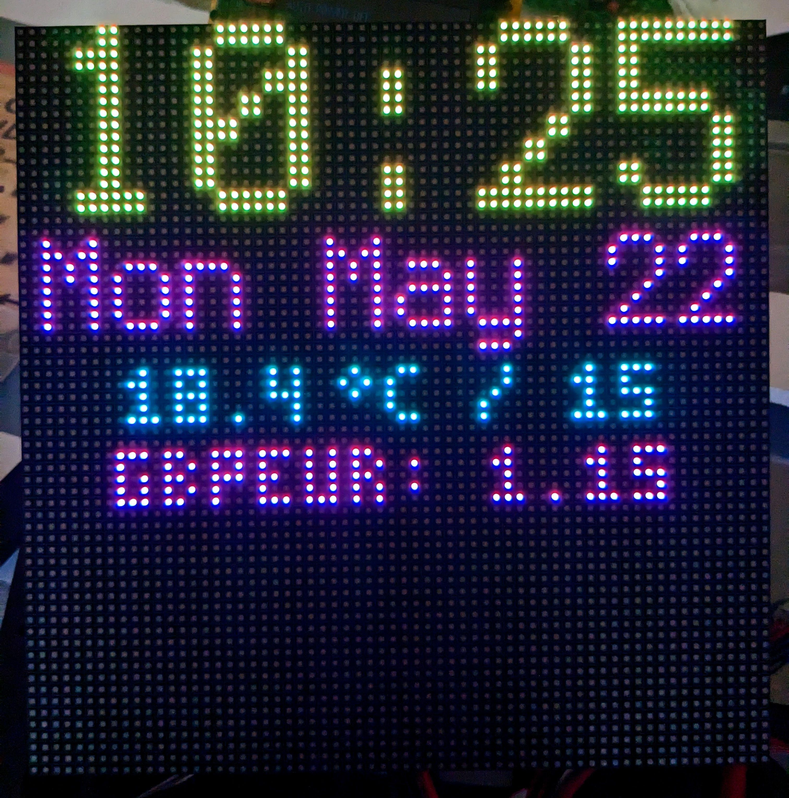
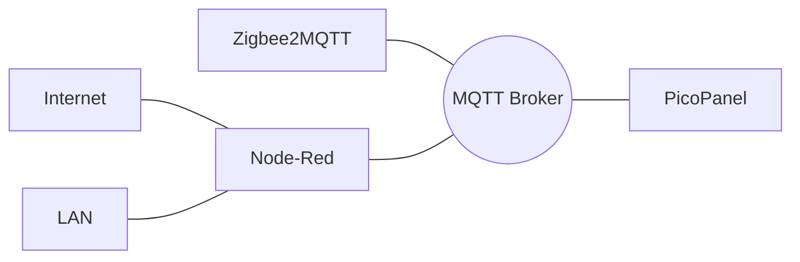

# picopanel
MQTT fed RGB LED Panel via Raspberry Pico W

This repo contains...
 * CircuitPython PicoPanel code (easily customisable)
 * Some very efficient fonts
 * Sample Node-RED flows for sending information to PicoPanel
 * Design and 3D files for a rear stand-off (P3 panel size)
  




## Usage Notes

### Layout Definition
The `config.py` file defines the information that is displayed on your panel.

For each live field you want displayed you should define a `<name>_TOPIC` variable and add a 
corresponding line to the `info` dict.

The format of the `info` elements is...

`<topic_name> : ["<prefix>", <x>, <y>, 0x<rrggbb>, "<font_alias>", <scale_factor>]`

* <topic_name> is a variable you previously set to the MQTT topic (see above)
* <prefix> is an optional string displayed before the MQTT payload
* <x> is the x ordinate of the start of the displayed item
* <y> is the y ordinate of the middle of the displayed item
* 0x<rrggbb> is the colour of the item in hex format
* <font_alias> is one of the known fonts, currently: `builtin`, `3x5`, and `4x6`
* <scale_factor> is a positive integer specifying how much the font is enlarged

### MQTT
MQTT messages on your BASE_TOPIC (set in `config.py`) wil be available to all picopanels that subscribe to them.

Set a unique DISPLAY_ID (a string) for each picopanel on your network.
This is used as the suffix of the CONTROL_TOPIC (`control`) to permit actions like turning a specific display on or off.

Eg. To turn off a display using the sample config send an `Off` payload to the `rgbmatrix/control1` topic.

The URGENT_TOPIC (`urgent`) displays a flashing message until an empty payload is delivered.

Eg. To alert viewer to a doorbell you could send `Door!` to the `rgbmatrix/urgent` topic - don't forget
to send an empty message after some time has elapsed.

### Reconfigure-via-MQTT
You can reconfigure PicoPanel wirelessly via MQTT.

There are two `control` messages to facilitate this:

A payload of `GetConfig` will cause PicoPanel to send the contents of the current `config.py` file on the `status1` topic.  It is handily prefixed and suffixed with the header and trailer needed for actual reconfiguration.

To perform the reconfiguration send the new contents of `config.py` to the panel's control topic with the following format...
```
RECONFIGURE
<file-contents>
EOF
```
Note that the header and trailer lines must end with a newline character.

If the message is received intact, picopanel will replace the old `config.py` with the contents of the payload and restart.
The old version will be saved as `config.py.old`.
