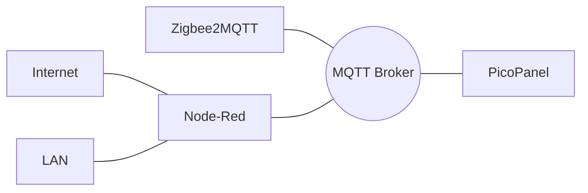

# picopanel
MQTT fed RGB LED Panel via Raspberry Pico W

This repo contains the CircuitPython code (easily customisable), design and 3D files for a rear stand-off (P3 panel size), and some very efficient fonts.




## Usage Notes
MQTT messages on your BASE_TOPIC (set in config.py) wil be available to all picopanels that subscribe to them.

Set a unique DISPLAY_ID (a string) for each picopanel on your network.
This is used as the suffix of the CONTROL_TOPIC (`control`) to permit actions like turning a display on or off.

Eg. To turn off a display using the sample config send an `Off` payload to the `rgbmatrix/control1` topic.

The URGENT_TOPIC (`urgent`) displays a flashing message until an empty payload is delivered.

Eg. To alert viewer to a doorbell you could send `Door!` to the `rgbmatrix/urgent` topic - don't forget
to send an empty message after some time has elapsed.

### Reconfigure-via-MQTT
To replace the `config.py` file on the fly, send a new version to the panel's control topic with the following format...
```
RECONFIGURE
<file-contents>
EOF
```
Note that the header and trailer lines must end with a newline character.

If the message is received intact, picopanel will replace the old `config.py` with the contents of the payload and restart.
The old version will be saved as `config.py.old`.
