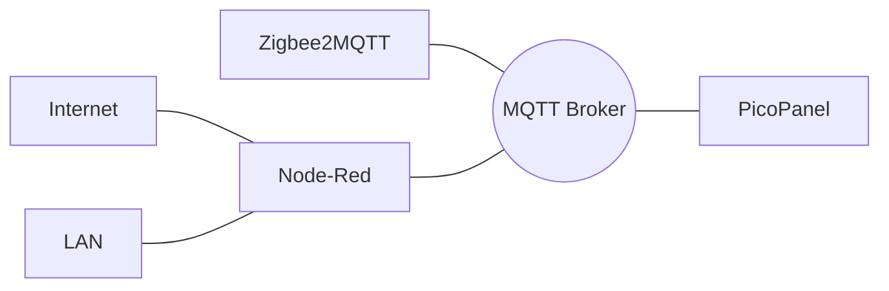

# picopanel
MQTT fed RGB LED Panel via Raspberry Pico W

```mermaid
flowchart LR
    I[Internet] --- | | R[Node-Red]
    L[LAN] --- R
    Z[Zigbee2MQTT] --- M
    R ---| |M((MQTT Broker))
    M ---| |P[PicoPanel]
```
