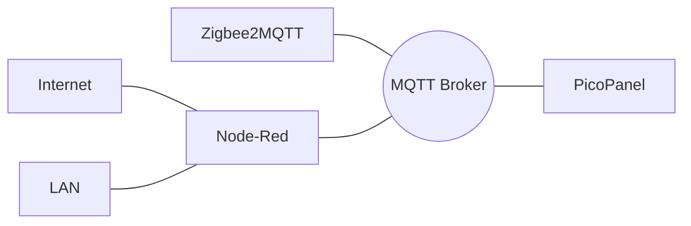

# picopanel
MQTT fed RGB LED Panel via Raspberry Pico W

This repo contains the CircuitPython code (easily customisable), design and 3D files for a rear stand-off (P3 panel size), and some very efficient fonts.

